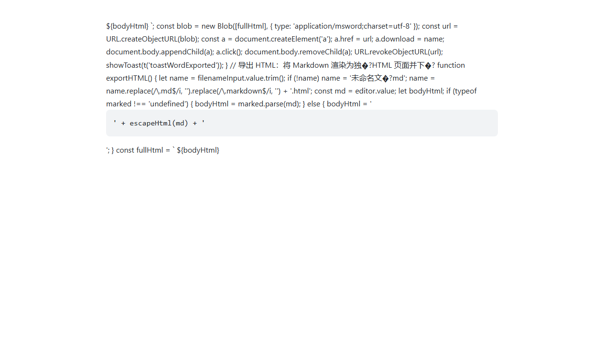

# Inkwell

> **单文件 3 MB · 完全离线 · 数据不出本地**
> Markdown / JSON 写作工作台 · 内置 6 家 AI 大模型 · 选中即改

---

## 🪶 有多便捷

- **下载即用** — 就是一个 `Inkwell.exe`，无需安装、无需登录、无需联网，放 U 盘里也能跑
- **双击文件直接打开** — 软件内点一下 🔗 即可关联系统，之后 `.md` / `.json` 双击就进编辑
- **数据永远是本地文件** — 不上云、不进数据库，随时用 VS Code / 记事本 / Git 接手，无锁定
- **界面跟着你变** — 4 张功能卡片随意显隐、6 组工具坞可拖成浮动工具条、
  面板比例全部记忆，下次启动原样恢复
- **中文界面** — 中英双语一键切换，提示、帮助、快捷键全套本地化

## 📂 支持的格式

**读写编辑**（自动检测编码，老文件不乱码；行尾符 CRLF / LF 原样保留）：

`.md` `.markdown` `.json` `.geojson` `.txt` `.csv` `.py` `.js` `.ts`
`.yaml` `.yml` `.toml` `.xml` `.html` `.css` `.sh` `.ps1` `.adoc`
`.rst` `.org` `.rtf` `.textile` `.mediawiki` `.opml` `.tex` ……（25+ 种）

**其中两种有专属模式**：

| 格式 | 专属体验 |
|---|---|
| **Markdown** | 实时预览（KaTeX 公式 / Mermaid 图表）、大纲跳转、全格式导出 |
| **JSON** | 预览自动校验 + 格式化 + 语法高亮，`Ctrl+Shift+F` 一键美化 |

**编码支持**：UTF-8 / UTF-8 BOM / UTF-16 LE/BE / GB18030 / Shift-JIS，打开旧文件或他人传的文件不乱码，可手动指定编码重开。

## ✍️ 能做什么

**写作**
- 所见即所得：左侧写 Markdown，右侧实时渲染；大纲自动生成，点击跳转
- 有序 / 任务列表自动编号续号，标题、表格、代码块、公式、图表一键插入
- 撤销重做完整历史，`Ctrl+Z` 随时回退

**AI 辅助**（可选，配好 Key 即用）
- 选中文字 → 润色 / 翻译（中↔英）/ 续写 / 总结，结果流式写入选区，不满意 Ctrl+Z
- 右下角 AI 对话面板：OpenAI / DeepSeek / 智谱 GLM / 通义千问 / Kimi / 本地 Ollama / 自定义端点

**图片**
- `Ctrl+V` 直接粘贴截图，自动存到文档旁的 `assets/`
- 拖拽图片文件进窗口即插入；其他工具（Typora 等）写的相对路径图片正常预览

**文件管理**
- 打开文件夹成套管理文档工程（文件树）
- 状态栏显示当前文档完整路径，点击在资源管理器中定位
- 网页转 Markdown：输入网址抓取正文存档

**导出** — Markdown / Word (.doc) / HTML（独立页面）/ PDF（打印另存）/ PNG 长图（多比例）

## 💻 运行环境

| 项目 | 要求 | 说明 |
|---|---|---|
| 操作系统 | Windows 10 1809+ / Windows 11 | 64 位 |
| .NET 10 Desktop Runtime | 需要 | 首次运行缺失会弹窗引导下载安装（约 50 MB，一次性） |
| WebView2 Runtime | 需要 | Win11 自带；Win10 缺失时同样弹窗引导（约 100 MB，一次性） |

- 下载：[GitHub Releases](https://github.com/gavin-new/Inkwell/releases/latest) → `Inkwell.exe`（约 3 MB）
- 配置与缓存存放于 `%LOCALAPPDATA%\Inkwell` 和 `~/.Inkwell`，卸载删文件即干净

---

## 📄 协议

**非商业使用许可** — 详见 [LICENSE](LICENSE)

- ✅ **允许**：个人学习、使用、修改、非商业分享（须保留版权与许可声明）
- ❌ **禁止**：未经授权的商业使用——销售本软件、企业/组织内部使用、集成进商业产品或收费服务等
- 💼 **商业授权**：gavin.zhang815@gmail.com

---

**Inkwell Ver 0.15** — 你的下一篇文章，从这里开始。
