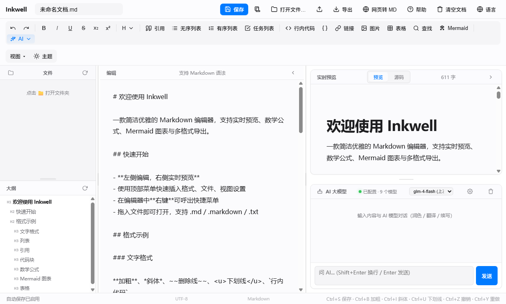

# Inkwell

> **单文件 3 MB · 完全离线 · 数据不出本地** 的 Markdown 写作工作台
> 3 列 5 区布局 · 内置 6 家 AI 大模型 · 选中即改

一个 EXE 搞定所有事：不用安装、不用登录、不用联网，你的文档永远是本地纯文本文件。
需要 AI 时，选中一段文字点一下，润色 / 翻译 / 续写 / 总结流式写入——所见即所得。

---

## 📸 主界面

---

## ✨ 核心功能

### 🤖 AI 选区编辑 — 最顺手的功能

选中一段文字 → 工具栏点对应按钮 → AI 结果**流式替换选区**：

- **✨ 润色** — 更流畅、更专业的措辞
- **🌐 翻译** — 中 ↔ 英自动判断方向
- **📝 续写** — 顺着你的风格写下去
- **📋 总结** — 压缩为简洁摘要

替换完不满意？`Ctrl+Z` 一键回到原文。

**多厂商开箱即用**，不锁任何一家：

| 服务商 | 适用场景 |
|---|---|
| **OpenAI** | gpt-4o-mini、gpt-4o 等 |
| **DeepSeek** | 国内可用、价格低 |
| **智谱 GLM** | glm-4-flash 等 |
| **通义千问** | qwen-turbo 等 |
| **Kimi 月之暗面** | 长文本 |
| **本地 Ollama** | 隐私优先、零成本 |
| **自定义** | OneAPI / LiteLLM / Open WebUI 等代理 |

除选区编辑外，右下角还有** AI 自由对话**面板，聊天、解释概念、问问题都顺手。

### 🗂️ 写作工作台 — 不只是编辑器

- **3 列 5 区布局** — 文件树 / 大纲 / 编辑 / 预览 / AI，各区可折叠、比例可调、记忆到下次启动
- **文件树** — 打开文件夹，整套 Markdown 工程一起管
- **大纲面板** — 自动解析 H1-H6，点击跳转，编辑时高亮跟随
- **实时预览** — 渲染 / 源码双模式，数学公式（KaTeX）、Mermaid 图表直接渲染

### 🔧 工程级细节

- **25+ 文件格式** — `.md` `.txt` `.csv` `.py` `.adoc` `.rst` `.org` `.tex` `.js` `.ts` `.json` `.yaml` `.toml` ……
- **多编码自动检测** — UTF-8 / UTF-8 BOM / UTF-16 / GB18030 / Shift-JIS，老文件不乱码
- **保留行尾符** — 改 Python/JS 文件时 CRLF / LF / 末尾换行原样写回
- **剪贴板贴图** — `Ctrl+V` 直接插入截图，自动存到 `assets/`
- **多格式导出** — Markdown / Word / HTML / PDF / PNG 长图
- **网页转 Markdown** — 把 URL 内容抓成 .md 存档

### 🎨 视觉设计

- 现代毛玻璃风格，明暗双主题跟随系统
- 浮动卡片布局，视觉聚焦
- 中英双语界面

---

## 🏆 为什么是 Inkwell

| | 常见方案 | Inkwell |
|---|---|---|
| 安装 | 装 Node / VS Code / 扩展 | 下载 EXE，双击运行 |
| 体积 | 数百 MB | **3 MB** 单文件 |
| 数据 | 云端或浏览器存储 | **本地文件**，随时用其他工具打开 |
| AI | 锁定单一订阅 | 6 厂商 + 本地 Ollama + 自定义端点 |

适合个人写作者、博主、学生、程序员写文档；不适合需要多人实时协作或云同步的场景（建议用 Git / Syncthing 自行同步）。

---

## 🚀 快速开始

### 安装

1. 从 [GitHub Releases](https://github.com/gavin-new/Inkwell/releases/latest) 下载 `Inkwell.exe`（约 3 MB）
2. 双击运行，**第一次**会弹出 .NET 10 / WebView2 Runtime 检测（缺哪个装哪个，一次性）
3. 开始写

系统要求：Windows 10 1809+ / Windows 11 · .NET 10 Desktop Runtime · WebView2 Runtime（Win11 必带）

### 配置 AI（可选，不配不影响其他功能）

1. 右下角 AI 面板点齿轮 ⚙
2. 选服务商（自动填 baseUrl 和默认模型）
3. 填 API Key → 测试连接 → 保存
4. 配置存到 `~/.Inkwell/ai-config.json`，下次启动自动加载

### 常用快捷键

| 操作 | 快捷键 |
|---|---|
| 保存 | `Ctrl+S` |
| 加粗 / 斜体 / 下划线 | `Ctrl+B` / `Ctrl+I` / `Ctrl+U` |
| 查找 / 替换 | `Ctrl+F` / `Ctrl+H` |
| 插入链接 / 图片 | `Ctrl+K` / `Ctrl+Shift+K` |
| 撤销 / 重做 | `Ctrl+Z` / `Ctrl+Y` |
| AI 选区润色 / 翻译 | 选中文本 → 工具栏 AI 按钮 |

---

## 🛠️ 技术栈

- **C# / .NET 10 / WinForms** — 原生 Windows 外壳
- **WebView2 (Edge 内核)** — 现代 Web 渲染，无浏览器依赖
- **HTML / CSS / JavaScript** — 纯 Web 标准前端，无构建步骤
- **marked + KaTeX + Mermaid** — Markdown / 公式 / 图表

---

## 📄 协议

**非商业使用许可** — 详见 [LICENSE](LICENSE)

- ✅ **允许**：个人学习、使用、修改、非商业分享（须保留版权与许可声明）
- ❌ **禁止**：未经授权的商业使用——销售本软件、企业/组织内部使用、集成进商业产品或收费服务等
- 💼 **商业授权**：gavin.zhang815@gmail.com

---

**Inkwell Ver 0.11a** — 你的下一篇文章，从这里开始。
